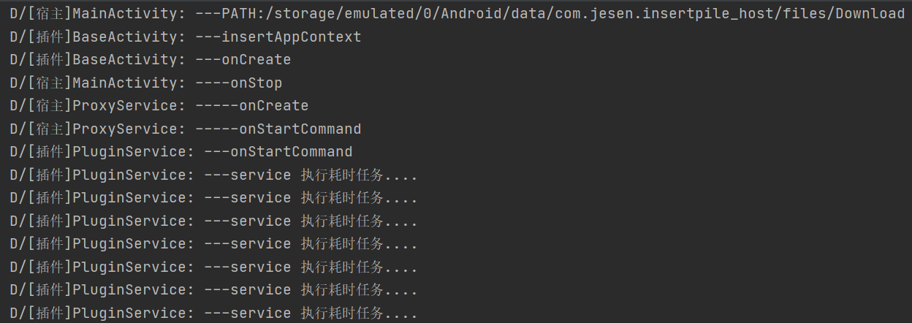
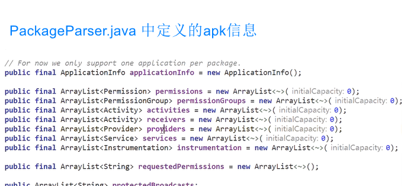

# AndPluginTalk

android plugin 总结

### 占位式

插件是未安装的apk, 在宿主中设定代理Activity,用来启动插件，就叫做**占位** 或
**插桩**。

    插件没有组件的环境，无法独立运行，所以要把宿主的运行环境给插件。这就需要标准来传递。


#### 占位式Activity通信


    

    

    

* 关键代码:
  * 获取ClassLoader:

```java
   File file = new File(PATH, "plug.apk");
         if (!file.exists()) {
             Log.d(TAG, " 插件apk不存在");
             return;
         }
         String plugPath = file.getAbsolutePath();
         Log.d(TAG,"插件路径："+plugPath);

         // DexClassLoader需要指定缓存目录
         File tmpDir = context.getDir("pDir", Context.MODE_PRIVATE);
         dexClassLoader = new DexClassLoader(plugPath,tmpDir.getAbsolutePath(),
                 null,context.getClassLoader());
```

   * 获取插件包的资源文件：

```java

 /**
           *  加载插件里的布局文件
           */
          // 获取资源管理器, 也可以用 context.getAssets();
          AssetManager assetManager = AssetManager.class.newInstance();
          // addAssetPathMethod用来添加插件包路径，以便加载插件包资源,String.class表示有一个String参数
          Method addAssetPathMethod = assetManager.getClass().getMethod("addAssetPath", String.class);
          addAssetPathMethod.invoke(assetManager,plugPath);
          // 宿主的资源配置信息
          Resources r = context.getResources();
          // 参数2参数3是资源的配置信息
          // 该resource会加载插件里资源，用有了宿主的资源配置
          plugResources = new Resources(assetManager, r.getDisplayMetrics(),r.getConfiguration());

```
   * 代理Activity启动插件Activity:

   ```java
      // 真正加载插件Activity
        String className = null;
        className = getIntent().getStringExtra("className");

        try {
            Class<?> pluginActivityClazz = getClassLoader().loadClass(className);
            // 实例化
            Constructor<?> constructor = pluginActivityClazz.getConstructor(new Class[]{});
            Object plugActivity = constructor.newInstance(new Object[]{});
            ActivityInterface activityInterface = (ActivityInterface) plugActivity;
            // 宿主的环境注入给插件
            activityInterface.insertAppContext(this);
            // 执行插件的onCreate()
            Bundle bundle = new Bundle();
            bundle.putString("pwd","Come from Host Proxy.");
            activityInterface.onCreate(bundle);

        } catch (Exception e) {
            e.printStackTrace();
        }
   ```

   * 插件内部启动Service,同样需要代理

  


   * 插件中的静态广播

    > 静态广播是手机开机时app会被再次安装，系统解析Manifest.xml文件，发现静态广播会自动发送。
    
    系统安装app会生成以下几个目录：
         data/app 安装文件放置目录
         data/data/com.xxx.xx/ 应用所属目录
         data/dalvik-cache  虚拟机去加载执行指令

    手机开机安装app的时候，安装完成后马上全盘扫描，data/app目录解析出apk文件里面所有组件，包括权限，AndroidManifest.xml
如果AndroidManifest.xml有静态配置的广播就会去注册它。

    安装相关类PackageManagerService
      
    安装流程简单概括为：Linux内核驱动  --- init进程  -- zygote进程孵化  SystemServer --- PackageManagerService启动
源码
```java
  mAppInstallDir = new File(dataDir, "app"); /data/app/目录
```
scanDirTracedLI 要去扫描 /data/app/目录下的apk文件  ---> 解析AndroidManifest 里面的所有信息


Package --->  apk 里面的 AndroidManifest配置信息,所以如果拿到了Package，就能拿到静态的广播信息
```xml
<receiver android:name=".PlugStaticReceiver"
     android:exported="true">
     <intent-filter>
          <action android:name="com.jesen.insertpile_plugin_static_BR"/>
     </intent-filter>
</receiver>
    
```
    关键代码，静态广播的注册：
  ```java
    // 插件包路径
            File file = new File(PATH, "plug.apk");
            if (!file.exists()) {
                Log.w(TAG, "plugin apk not exists...");
                return;
            }
            
            // 实例化 PackageParser对象
            Class packageParserClass = Class.forName("android.content.pm.PackageParser");
            Object packageParser = packageParserClass.newInstance();

            // 1.执行此方法 public Package parsePackage(File packageFile, int flags)是为了拿到Package
            Method packageParserMethod = packageParserClass.getMethod("parsePackage", File.class, int.class); // 类类型
            Object mPackage = packageParserMethod.invoke(packageParser, file, PackageManager.GET_ACTIVITIES);  // 执行方法

            // 得到 receivers
            Field receiversField = mPackage.getClass().getDeclaredField("receivers");
            // receivers 本质就是 ArrayList 集合
            Object receivers = receiversField.get(mPackage);

            ArrayList arrayList = (ArrayList) receivers;

            // 此Activity 不是组件的Activity，是PackageParser里面的内部类
            // mActivity --> <receiver android:name=".StaticReceiver">
            for (Object mActivity : arrayList) {
                // 获取 <intent-filter>
                // 通过反射拿到 intents,即多个<intent-filter>的数组
                // Component是内部类
                Class mComponentClass = Class.forName("android.content.pm.PackageParser$Component");
                Field intentsField = mComponentClass.getDeclaredField("intents");
                ArrayList<IntentFilter> intents = (ArrayList) intentsField.get(mActivity);

                // 要拿到广播接收者 android:name=".pluginStaticReceiver"
                // 那么需要拿到 ActivityInfo
                Class mPackageUserState = Class.forName("android.content.pm.PackageUserState");

                Class mUserHandle = Class.forName("android.os.UserHandle");
                int userId = (int) mUserHandle.getMethod("getCallingUserId").invoke(null);

                /**
                 * 执行方法generateActivityInfo，就能拿到 ActivityInfo
                 * public static final ActivityInfo generateActivityInfo(Activity a, int flags,
                 *             PackageUserState state, int userId)
                 */
                Method generateActivityInfoMethod
                        = packageParserClass.getDeclaredMethod("generateActivityInfo",
                        mActivity.getClass(), int.class, mPackageUserState, int.class);
                generateActivityInfoMethod.setAccessible(true);
                // 执行此方法，拿到ActivityInfo
                ActivityInfo mActivityInfo = (ActivityInfo) generateActivityInfoMethod
                        .invoke(null, mActivity, 0, mPackageUserState.newInstance(), userId);
                // 最终拿到广播接收
                String receiverClassName = mActivityInfo.name;
                Class mStaticReceiverClass = getClassLoader().loadClass(receiverClassName);
                BroadcastReceiver broadcastReceiver = (BroadcastReceiver) mStaticReceiverClass.newInstance();

                for (IntentFilter intentFilter : intents) {
                    // 注册静态广播
                    context.registerReceiver(broadcastReceiver, intentFilter);
                }
  ```

