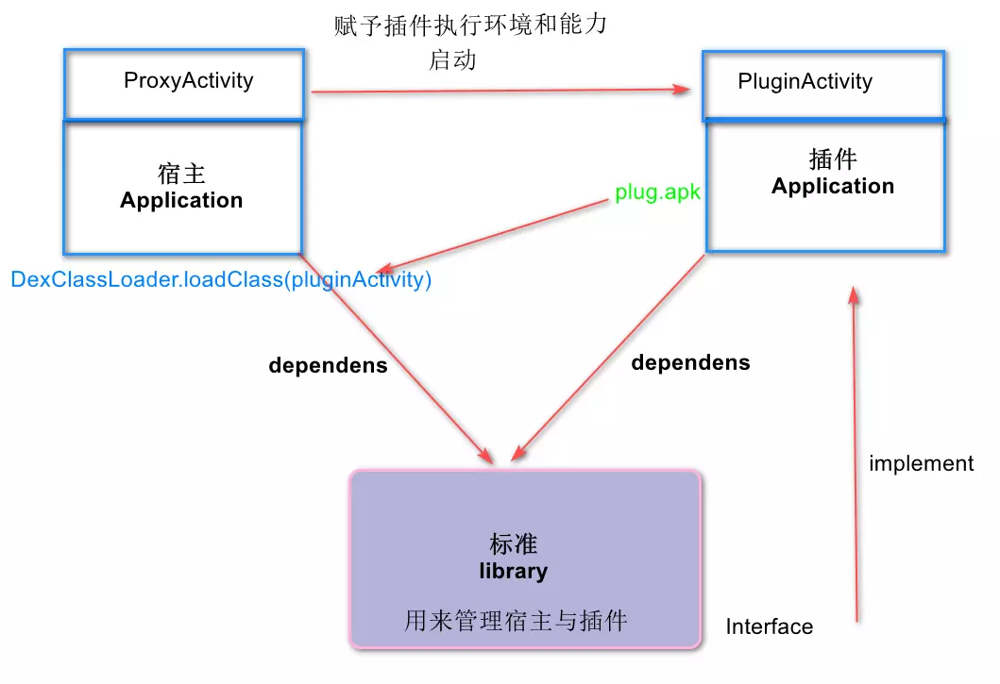

# AndPluginTalk

android plugin 总结

### 占位式

插件是未安装的apk, 在宿主中设定代理Activity,用来启动插件，就叫做**占位** 或
**插桩**。

    插件没有组件的环境，无法独立运行，所以要把宿主的运行环境给插件。这就需要标准来传递。


#### 占位式Activity通信


    

    

    

* 关键代码:
  * 获取ClassLoader:

```java
   File file = new File(PATH, "plug.apk");
         if (!file.exists()) {
             Log.d(TAG, " 插件apk不存在");
             return;
         }
         String plugPath = file.getAbsolutePath();
         Log.d(TAG,"插件路径："+plugPath);

         // DexClassLoader需要指定缓存目录
         File tmpDir = context.getDir("pDir", Context.MODE_PRIVATE);
         dexClassLoader = new DexClassLoader(plugPath,tmpDir.getAbsolutePath(),
                 null,context.getClassLoader());
```

   * 获取插件包的资源文件：

```java

 /**
           *  加载插件里的布局文件
           */
          // 获取资源管理器, 也可以用 context.getAssets();
          AssetManager assetManager = AssetManager.class.newInstance();
          // addAssetPathMethod用来添加插件包路径，以便加载插件包资源,String.class表示有一个String参数
          Method addAssetPathMethod = assetManager.getClass().getMethod("addAssetPath", String.class);
          addAssetPathMethod.invoke(assetManager,plugPath);
          // 宿主的资源配置信息
          Resources r = context.getResources();
          // 参数2参数3是资源的配置信息
          // 该resource会加载插件里资源，用有了宿主的资源配置
          plugResources = new Resources(assetManager, r.getDisplayMetrics(),r.getConfiguration());

```
   * 代理Activity启动插件Activity:

   ```java
      // 真正加载插件Activity
        String className = null;
        className = getIntent().getStringExtra("className");

        try {
            Class<?> pluginActivityClazz = getClassLoader().loadClass(className);
            // 实例化
            Constructor<?> constructor = pluginActivityClazz.getConstructor(new Class[]{});
            Object plugActivity = constructor.newInstance(new Object[]{});
            ActivityInterface activityInterface = (ActivityInterface) plugActivity;
            // 宿主的环境注入给插件
            activityInterface.insertAppContext(this);
            // 执行插件的onCreate()
            Bundle bundle = new Bundle();
            bundle.putString("pwd","Come from Host Proxy.");
            activityInterface.onCreate(bundle);

        } catch (Exception e) {
            e.printStackTrace();
        }
   ```


